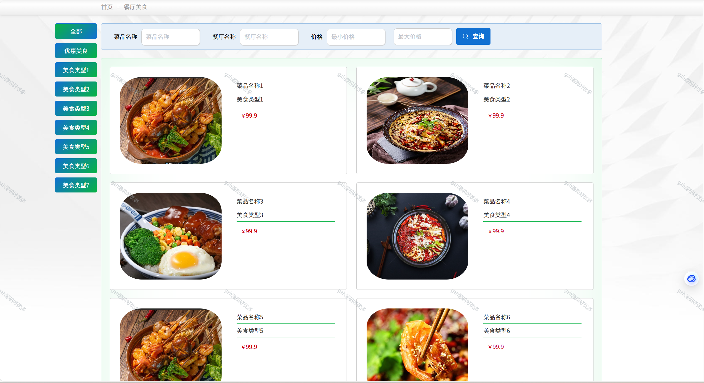

# springbootA242
springbootA242餐厅信息管理系统+LW+PPT
 
## 查看主页获取源码

### 一、关键词
餐饮信息管理系统，餐厅数字化管理系统，餐厅业务管理系统

### 二、作品包含
源码+数据库+设计文档万字+全套环境和工具资源+部署教程

### 三、项目技术
前端技术：Html、Css、Js、Vue2.0、Element-ui 
后端技术：Java、SpringBoot2.0、MyBatis

### 四、运行环境（以下版本亲测，其他版本未知，请自测）
开发工具：IDEA/eclipse  + VSCODE

数据库：MySQL5.7（最低要5.7版本）

数据库管理工具：Navicat10以上版本

环境配置软件： JDK1.8 + Maven3.6.3

前端Nodejs：14

浏览器：谷歌浏览器

### 五、项目介绍
项目编号：springbootA242

以餐厅信息管理方面为切入点，论述了餐厅信息管理的意义和内容，以此展开对餐厅信息的开发与建设的详细分析。从数据挖掘的角度出发，了解信息管理系统的作用，对餐厅信息的过程以及用处进行更深一步的研究，数据的处理效率，以及具体的应用方向。对于餐厅信息管理系统所带来的影响，将从传统管理方式进行对比分析，从硬件优化、软件开发，这几个方面来论述餐厅信息管理系统的优势所在，分析餐厅信息管理在计算机时代发展的变化趋势.

### 六、运行截图

